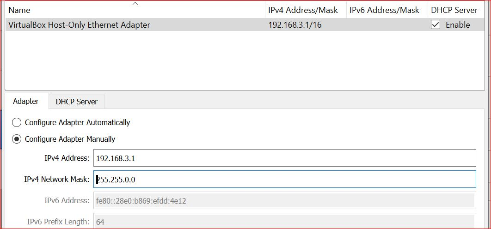
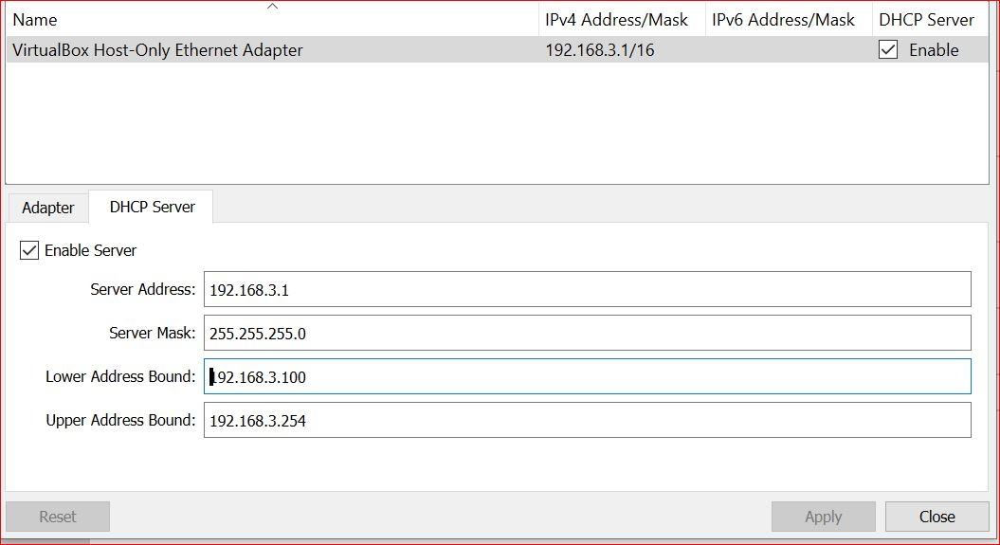

[Grant McWilliams Courses](https://www.linkedin.com/learning/instructors/grant-mcwilliams)<br/>
[This course](https://www.linkedin.com/learning/red-hat-certified-engineer-ex294-cert-prep-1-foundations-of-ansible)
# Ansible Red Hat Certified EX294 Prep 1
Index
 - installing ansible engine
 - configuring communication
 - creating static inventory
 - configure ad-hoc commands
 - create ansible-playbook

## Installing Ansible Engine
### Network configuration
#### Vagrant setup
In order to configure network to be used in these virtual machines, we have to use 2 network interfaces
* NAT
* Host-Only Adapter

Host Only adapter is the default private network in vagrant, to use specific settings, you have to create a network interface in Virtuak Box as:
````
              Name: "VirtualBox Host-Only Ethernet Adapter"
      IPv4 Address: "192.168.3.1"
 IPv4 Network Mask: "255.255.0.0"
````

And DHCP Server settings as:
````
Server Address: 192.168.3.1
Server Mask: 255.255.255.0
Lower Address Bound: 192.168.3.100
Upper Address Bound: 192.168.3.254
````
DHCP Must be disabled



## Ansible Hosts
> vi /etc/ansible/hosts
add the address from slaves then
> ansible all --list-hosts

### Create ssh key files
> ssh-keygen
In rhSlave1 modify /etc/ssh/sshd_config  and uncomment the line
   - PasswordAuthentication yes
and comment the line
   - PasswordAuthentication no
re-start ssh config as:
> sudo systemctl reload sshd

go to Manager Machine and copy the ssh key to Slave machine
> ssh-copy-id vagrant@rhSlave1
password for vagrant user is vagrant by default

go back to rhSlave1 and undo changes as
In rhSlave1 modify /etc/ssh/sshd_config  and uncomment the line
   - PasswordAuthentication yes
and comment the line
   - PasswordAuthentication no
re-start ssh config as:
> sudo systemctl reload sshd

### to change the sshd_config by script you can use:
````
  to remove the # in front of *PasswordAuthentication yes*
   sudo cp sudo sed -re 's/^(\#)(PasswordAuthentication)([[:space:]]+)(.*)/\2\3\4/' /etc/ssh/sshd_config > ./sshd_config.new
````
*save the new document in the PWD because need root access to be saved in /etc/ssh*

  to add # in front of *PasswordAuthentication yes* is <span style="color:red">NOT POSSIBLE</span>

test the ansible connections as:
> ansible -m ping all
Output:
````
192.168.3.109 | SUCCESS => {
    "ansible_facts": {
        "discovered_interpreter_python": "/usr/libexec/platform-python"
    },
    "changed": false,
    "ping": "pong"
}
````
for Ansible documentation see [Ansible docs](https://docs.ansible.com/ansible/latest/)

Ansible man pages are:
   - ansible-config
   - ansible-console
   - ansible-galaxy
   - ansible-inventory
   - ansible-playbook
   - ansible-pull
   - ansible-vault
   - ansible-doc

Ansible plugins Types
   - become
   - cache
   - callback
   - cliconf
   - connection
   - httpapi
   - inventory
   - lookup
   - netconf
   - shell
   - strategy
   - vars

## Ansible inventory
   - List or hosts to work against
   - Host or groups of hosts are targeted for action
   - Default inventory file - /etc/ansible/hosts
   - Ansible-playbook -i /home/user1/hosts
   -

## Ansible syntax
> Ansible [pattern] -m [module] -a "[Module options]"

example
 display teh variable DISPLAY
>ansible webservers -m shell -a 'echo $DISPLAY'

to reboot all webservers
> ansible webservers -a "/sbin/reboot"

### Command Module
   - Doesn't use a shell
   - No support for pipes directs
   - No user environment
   - Simple
   - Secure

### Shell Module
   - Runs command in Shell
   - Supports pipes/redirects
   - Has user environment
   - More complex
   - More compatible

### Ansible Paralization
> ansible webservers -a "/sbin/reboot"

Run a command as a different user
> ansible webservers -a "/sbin/reboot" -u user1

Ansible OS Modules [TODO]
> ansible webservers -m copy -a "src=/etc/hosts dest=./hosts"
> ansible webservers -m file -a "dest=/home/db.txt mode=600"
>


### commands examples
> ansible rhSlave* -m file -a "path=/home/vagrant/file2.txt state=touch mode=700"
> ansible rhSlave1* -m copy -a "dest=/home/vagrant/file3.txt content='this is a test from ansible' force=no mode=700"
>  force=no do not change the file if it already exists

install packages
> ansible rhSlave* -m yum -a "name=httpd state=installed" -b -k
Remove packages
> ansible rhSlave* -m yum -a "name=httpd state=absent" -b -k
re-start a service
>ansible rhSlave* -m service  -a "nme=httpd state=started" -b -kernel-headers

enable a service to be persisten
> ansible rhSlave* -m service -a "name=httpd enabled=yes" --checked

list a directory
> ansible rhSlave* -m shell -a "ls"


gather dat
> ansible rhSlave1* -m setup

gather a portion of values
> ansible rhSlave1* -m setup -a 'gather_subset=network'

gather subsets:
  - all  --> Always
  - min  -- minimum
  - hardware
  - network
  - virtual
  - facter

### gather more than one subsets
> ansible rhSlave1* -m setup -a 'gather_subset=virtual,hardware'

### ansible commands

|Argument     |    Functionality    |
|-------------|---------------------|
|list-hosts   |output list of hosts |
|play-book-dir|defines playbook directory|
|private-key  | defines a private key|
|syntax-check | checks playbook syntax |
| -b -K       | runs operations with become and ask for password|
| -k or -ask-pass| asks for connection password |
| -e | sets environment variables |
| -i | specify a path for inventory file |
| -m | spceciy a module name |
| -a | specify for a module arguments |
| -v | specify verbose module |

### Ansible configuration files
> /etc/ansible/ansible.cfg<br/>
> ./ansible/ansible.cfg<br/>
> ~/ansible/ansible.cfg<br/>
to view the config files above you can use
> ansible-config view


### show current ansible configuration
show configuration extended (dsfinition of each value)
> ansible-config list

show short configuration (only values)
> ansible-config dump

  get the inventory in json format
> ansible-inventory --list --output inventory.json
  get the inventory in graph mode
> ansible-inventory --graph
  get the inventoy in yml format
>  ansible-inventory --list -y

## Playbooks
Playbooks directory will be ~/ansible-files

create a new paybook as apache.yml:
````yml
-  name: apache server installed
   hosts: webservers
   become: yes
   tasks:
     - name: latest apache version installed
       yum:
         name: httpd
         state: latest
     - name: Apache enable and running
       service:
         name: httpd
         enabled: true
         state: started

````
To check Ansible syntax in a playbook file:
ansible-playbook apache.yml --syntax-check
# Ansible Red Hat Certified EX294 Prep 2
## Playbooks
Summary
   - Playbooks targets hosts in webserver group
   - Set some variables
   - Runsyum as root
   - Installs or updates httpd packages
   - Proceeds with the next play if it exists

## Configuration Formats
   - Key-value pairs
   - INI files
   - YAML files *
   - JSON
   - XML

YAML is the prefered format,
   - YAML is not specific to Ansible
   - Minimal syntax
   - Doesn't try to be a programming language
   - Hierarchical structure
   - Reliance on syntatic whitespaces

## Install atom editor
create a file on /etc/yum.repos.d/atom.repo as
````INI
[Atom]
name=Atom Editor
baseurl=https://packagecloud.io/AtomEditor/atom/el/7/$basearch
enable=1
gpgcheck=0
repo_gpgcheck=1
gpgkey=https://packagecloud.io/AtomEditor/atom/gpgkey
````
Install atom as:
> sudo yum -y install atom

atom is an editor for GUI in linux

Ceate structured Playbooks
   roles
      - base
        - handlers   - contains change handlers by the role
        - tasks      - contains the list of tasks to be executed by the role
        - templates  - contains templates for the role
        - files      - contains files to be deployed by the role
        - vars       - contains non-default variables for the role
        - defaults   - contains default values for the role
        - meta       - contains non-default variables for the role
          - main.yml
             allow_duplicates: true
             dependencies:
              - role: apache
              vars:
               apache_port: 80

      - dbservers
        - handlers/main.yml
        - tasks/main.yml
        - templates/main.yml
      - webservers
        - handlers
        - tasks
        - templates


File struture
 - ansible-files/hosts
 - ansible-files/site.yml
 - ansible-files/roles/base/main.yml

By default ssh can not be connect using root
copy the ssh key to the host using
> ssh vagrant@rhSlave1.localnet.com

modify the ssh config file: sudo vi /etc/ssh/sshd_config in the host
```
# Authentication:
#LoginGraceTime 2m
PermitRootLogin yes
#StrictModes yes
#MaxAuthTries 6
#MaxSessions 10
```

return back to server
copy the ssh-key as:
> ssh-copy-id root@rhSlave1.localnet.com

### what is ansible-lint [About Ansible Lint ](https://ansible-lint.readthedocs.io/en/latest/)<br/>
Ansible Lint is a command-line tool for linting playbooks, roles and collections aimed towards any Ansible users. Its main goal is to promote proven practices, patterns and behaviors while avoiding common pitfalls that can easily lead to bugs or make code harder to maintain.

Ansible lint is also supposed to help users upgrade their code to work with newer versions of Ansible. Due to this reason we recommend using it with the newest version of Ansible, even if the version used in production may be older.

As any other linter, it is opinionated. Still, its rules are the result of community contributions and they can always be disabled based individually or by category by each user.

Ansible Galaxy project makes use of this linter in order to compute quality scores for Galaxy Hub contributed content. This does not mean this tool is aimed only to those that want to share their code. Files like galaxy.yml, or sections like galaxy_info inside meta.yml help with documentation and maintenance, even for unpublished roles or collections.

The project was originally started by @willthames, and has since been adopted by the Ansible Community team. Its development is purely community driven, while keeping permanent communications with other Ansible teams.

### Verify playbooks (one of the following)
> yamllint apache.yml
> ansible-playbook --check apache.yml
> ansible-lint apache.yml

## Ansible Modes for roles
- Static roles < ansible 2.3
- Dynamic Roles > Ansible 2.3
   Include_role

### Ansible Dynamic Content reuse
- Include_role
- Include_tasks
- include (static/dynamic depending on context) deprecaterd
- import_playbook
- import_role
- import_tasks

- Reusing content can be static or dynamic
- Static and dynamic content can be mixed
- Mixed static and dynamic content is not recomended
  makes dificuklt to troubleshoot Playbooks

#### Advantages/Disadvantes of include
- Includes work in loops
- can't trigger a handler name inside of an Include
- You can however trigger the entire Include

#### Advantages/Disadvantes of import
- Do niot work in loops
- Cannot use variables from inventory resources for role names
   host/group vars
- Handlers will not be triggered when notified by their name
   Importing overwrites handler's name with imported task list

execute the playbook
 ansible-playbook -i hosts site.yml

[playbooks filters](https://docs.ansible.com/ansible/latest/user_guide/playbooks_filters.html)<br/>
[special variables](https://docs.ansible.com/ansible/latest/reference_appendices/special_variables.html)<br/>